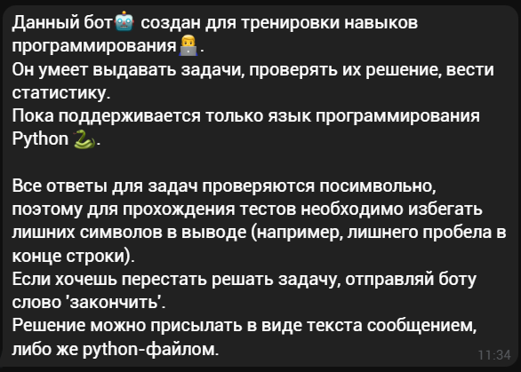
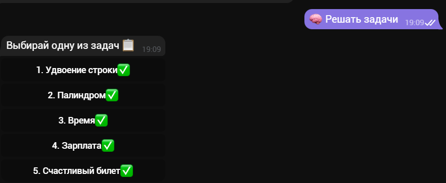
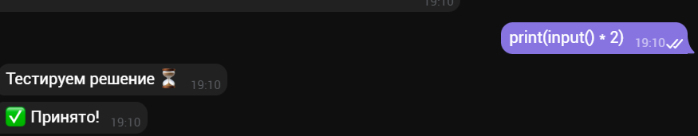
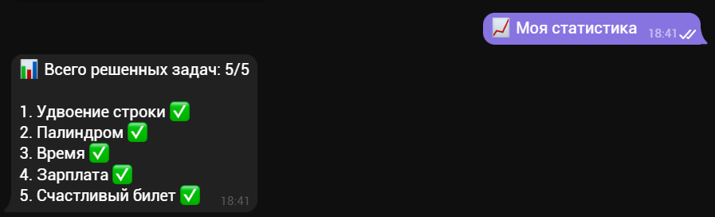
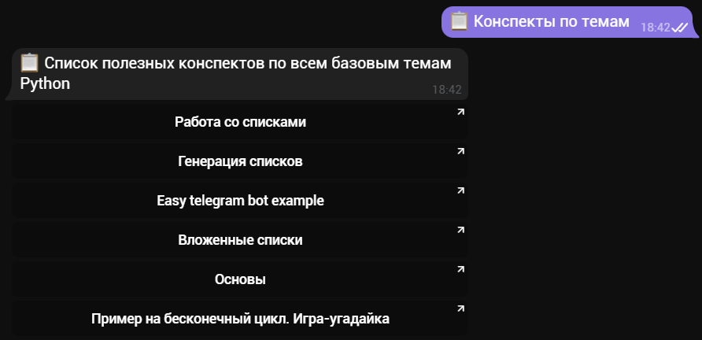

# Telegram bot for training your programming skills

This bot has some programming tasks that you can get, write and test directly in this bot.

Bot will show you result of your solution.
Moreover, bot has your stats and progress.

And one more feature: there are some theory summary about Python.

Now you can write your solution only using Python.

### Demonstration

Choice task:

Write solution and get result:

Check your stats:

Read the theory:
